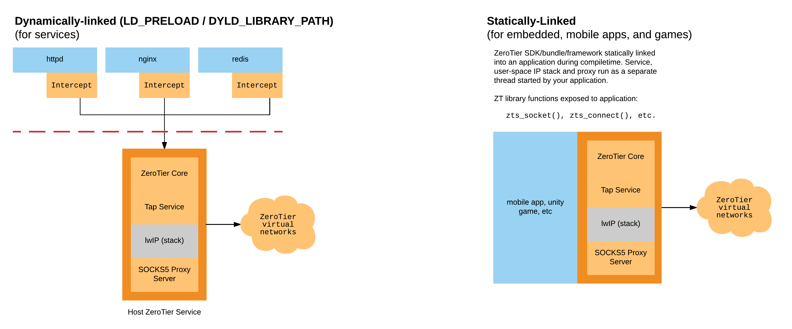

ZeroTier SDK
======

ZeroTier-enabled apps, devices, and services.

 - For a convenient BSD socket-style API, follow the rest of this document.
 - For information on the core ZT API, see [ZeroTierOne.h](zerotierone/include/ZeroTierOne.h)

Secure virtual network access embedded directly into applications, games, and devices. Imagine starting an instance of your application or game and having it automatically be a member of your virtual network without having to rewrite your networking layer. Check out our [Integrations](integrations/) to learn how to integrate this into your application, device, or ecosystem.

The general idea is this:
	1) Your application starts.
	2) The API and ZeroTier service initializes inside a separate thread of your app.
	3) Your app can now reach anything on your virtual network via normal network calls.

It's as simple as that!

To build everything for your platform, you can start with:

 - On Linux: `make linux SDK_PICOTCP=1 SDK_IPV4=1 SDK_DEBUG=1; make -s check; ls -lG build`
 - On macOS: `make apple SDK_PICOTCP=1 SDK_IPV4=1 SDK_DEBUG=1; make -s check; ls -lG build`

***

The SDK couples the ZeroTier core Ethernet virtualization engine with a user-space TCP/IP stack and a carefully-crafted API which intercepts and re-directs network API calls to our service. This allows servers and applications to be used without modification or recompilation. It can be used to run services on virtual networks without elevated privileges, special configuration of the physical host, kernel support, or any other application specific configuration. It's ideal for [containerized applications](../integrations/docker), [games](../integrations/Unity3D), and [desktop/mobile apps](../integrations).

Combine this functionality with the network/device management capabilities of [ZeroTier Central](https://my.zerotier.com) and its associated [API](https://my.zerotier.com/help/api) and we've hopefully created a simple and reliable way for you to flatten and reduce the complexity of your app's networking layer.

The ZeroTier SDK now works on both *x64* and *ARM* architectures. We've tested a beta version for *iOS*, *Android*, *Linux*, and *macOS*.

## How do I use it?

There are generally two ways one might want to use the service. 

 - The first approach is a *compile-time static linking* of our service library directly into your application. With this option you can bundle our entire functionality right into your app with no need to communicate with a service externally, it'll all be handled automatically. This is most typical for mobile applications, games, etc.

 - The second is a service-oriented approach where our smaller intercept library is *dynamically-linked* into your app upon startup and will communicate to a single ZeroTier service on the host which will relay traffic to and from the ZeroTier virtual network. This can be useful if you don't have access to the app's source code and can't perform a static linking.

## How does it work?

We've designed a background tap service that pairs the ZeroTier protocol with swappable user-space network stacks. We've provided drivers for [Lightweight IP (lwIP)](http://savannah.nongnu.org/projects/lwip/) and [picoTCP](http://www.picotcp.com/). The aim is to give you a new way to bring your applications onto your virtual network. For a more in-depth explanation of how it works take a look at our [SDK Primer](docs/zt_sdk_primer.md)

## APIs

**Hook/Intercept**
- Uses dynamic loading of our library to allow function interposition or "hooking" to re-implement traditional socket API functions like `socket()`, `connect()`, `bind()`, etc.

**Direct Call**
- Directly call the `zt_` API specified in [src/sdk.h](src/SDK.h). For this to work, just use one of the provided headers that specify the interface for your system/architecture and then either dynamically-load our library into your app or statically-link it at compile-time.

***
## Important Build Flags

- `SDK_IPV4=1` - Enable IPv4 support
- `SDK_IPV6=1` - Enable IPv6 support

- `SDK_DEBUG=1` - Enables SDK debugging

- `SDK_PICOTCP=1` - Enable the use of `picoTCP` (recommended)
- `SDK_PICOTCP_DEBUG=1` - Enables debug output for the `picoTCP` network stack

- `SDK_LWIP=1` - Enable the use of `lwIP` (deprecated)
- `SDK_LWIP_DEBUG=1` - Enables debug output for the `lwIP` library.

***

### Apple 
 - For everything: `make apple`

##### iOS
 - [Embedding within an app](apple/example_app/iOS) `make ios_app_framework` -> `build/ios_app_framework/*`
 - Unity3D plugin `make ios_unity3d_bundle` -> `build/ios_unity3d_bundle/*`

##### OSX
 - [Linking into an app at compiletime](../docs/osx_zt_sdk.md) `make osx_shared_lib` -> `build/libztosx.so`
 - [Embedding within an app with Xcode](apple/example_app/OSX) `make osx_app_framework` -> `build/osx_app_framework/*`
 - [Dynamic-linking into an app/service at runtime](../docs/osx_zt_sdk.md) `make osx_service_and_intercept` -> { `build/zerotier-sdk-service` + `build/libztintercept.so` }
 - [Intercept library](../docs/osx_zt_sdk.md) `make osx_sdk_service` -> `build/zerotier-sdk-service`
 - [SDK Service](../docs/osx_zt_sdk.md) `make osx_intercept` -> `build/libztintercept.so`
 - [Unity3D plugin](apple/ZeroTierSDK_Apple) `make osx_unity3d_bundle`

***
### Linux
 - For everything: `make linux`
 - [Dynamic-linking into an app/service at runtime](../docs/linux_zt_sdk.md) `make linux_shared_lib`
 - Service and Intercept `make linux_service_and_intercept` -> { `build/zerotier-sdk-service` + `build/libztintercept.so` }
 - [Using the SDK with Docker](docker)

### Android 
 - For everything: `make android`
 
 - [Embedding within an app](android) `make android_jni_lib` -> `build/android_jni_lib/YOUR_ARCH/libZeroTierOneJNI.so`
 - [Unity 3D plugin](../docs/android_unity3d_zt_sdk.md) `make android_unity3d_plugin` -> `build/android_unity3d_plugin/*`

***
### Windows
 - Not yet.

***

More discussion can be found in our [original blog announcement](https://www.zerotier.com/blog/?p=490) and [the SDK product page](https://www.zerotier.com/product-netcon.shtml).
If you have any feature or support requests, be sure to let us know [here](https://www.zerotier.com/community/)!
